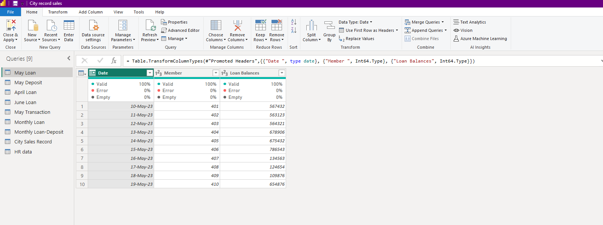
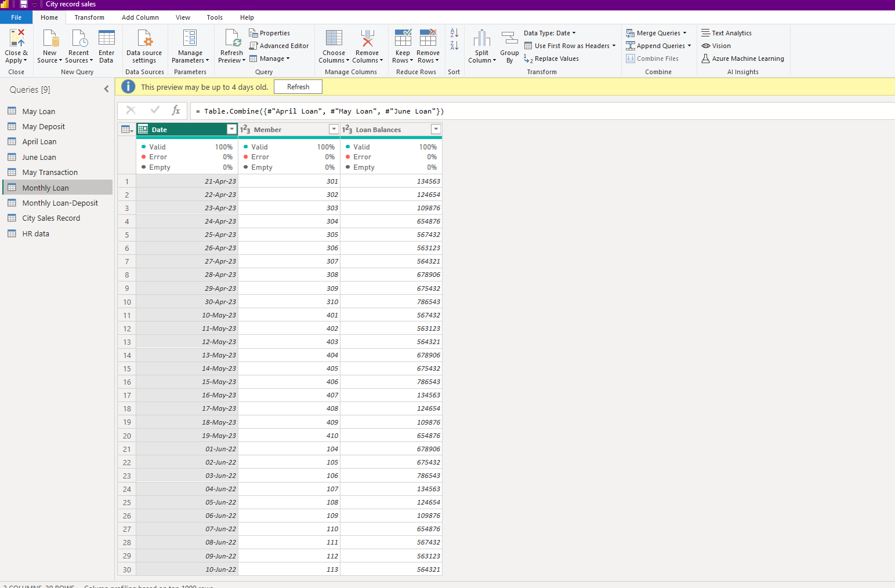

# INCUBATOR-NG-DATA-ANALYSIS-TRAINING
This repo talks about my personal projects in data analysis with Incubator Nigeria.
  
***

## FIRST CONTACT: _Data Cleaning_   
Started my journey into Data Analysis learning how to clean data, undertanding that working with data also has to do with paying attention to data types, merging and appending data with diffrent commands on the Power Querry.

1.) **Data Cleaning:** This is the process of identifying incomplete, incorrect, inaccurate or irrelevant parts of the data and then replacing, modifying, or deleting the dirty data.

  
***
2.) **Appending:** It is involves enhancing and enriching existing datasets by adding missing information to them or adding more data to them.
  

  

***
3.) **Merging:** is integrating two or more comparable data into a unified database.
  

***

