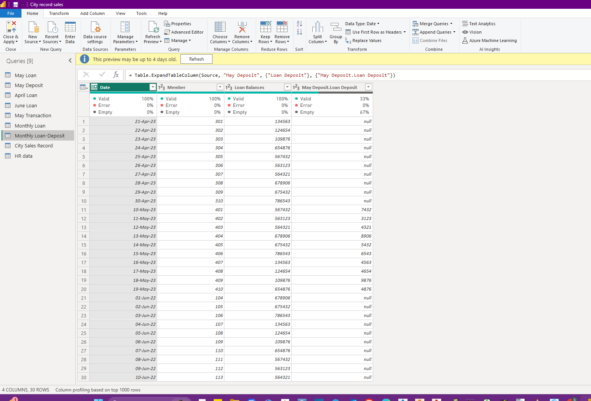

# INCUBATOR-NG-DATA-ANALYSIS-TRAINING
This repo talks about my personal projects in data analysis with Incubator Nigeria.
  

## FIRST CONTACT: _Data Cleaning_   
Started my journey into Data Analysis learning how to clean data, undertanding that working with data also has to do with paying attention to data types, merging and appending data with diffrent commands on the Power Querry.

1.) Data Cleaning

  
2.) Appending

  
3.) Merging

***
## FIRST CONTACT: _Populating Data_   
1.) 

